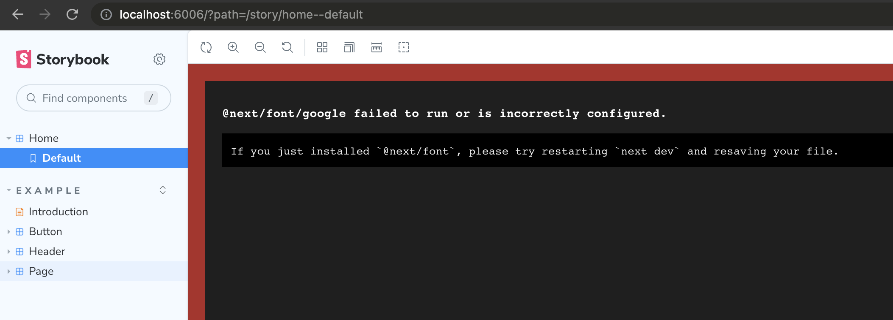
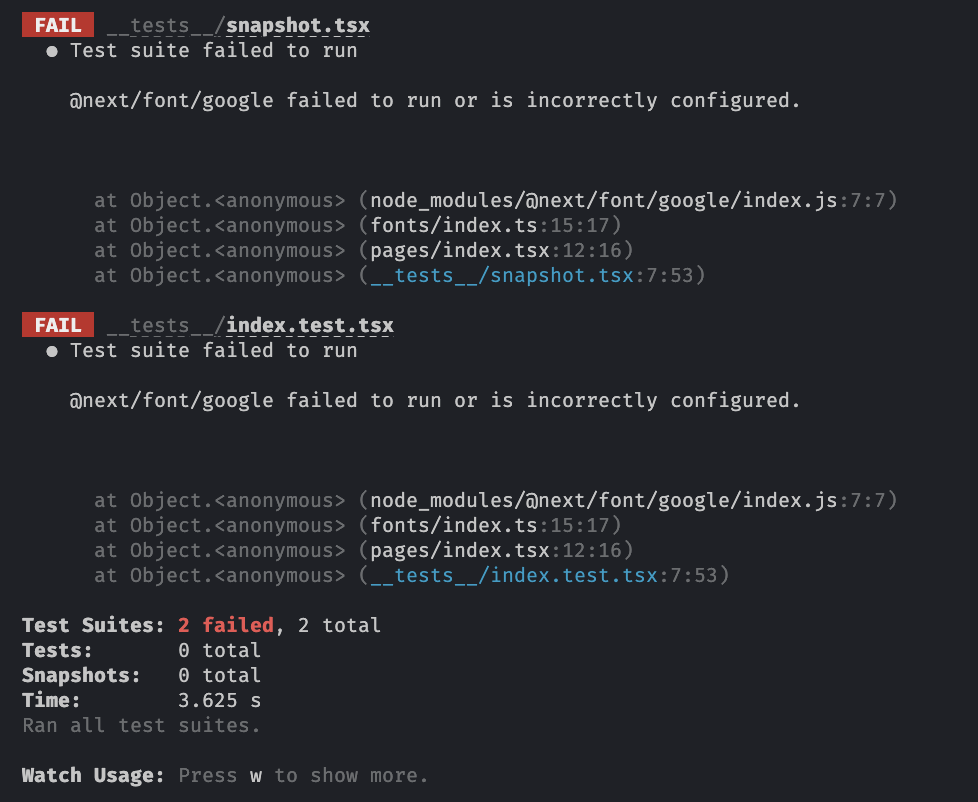

# Next.js Font component + Jest + Storybook

This example reproduces an error when using @next/font component and trying to render a component outside of Next.js, such as in Jest or Storybook.

The fonts are defined in `fonts/index.ts` and used both at a global level in `pages/_app.tsx` and at the HomePage component in `pages/index.tsx`.

## Storybook

To run Storybook, run the following command:

```bash
yarn storybook
```

A browser will open showing you a failure to render the Home component.



## Jest Tests

To run tests, run the following command:

```bash
yarn test
```

The same failure will happen, even though `next/jest' is being used to set up tests in this project.

